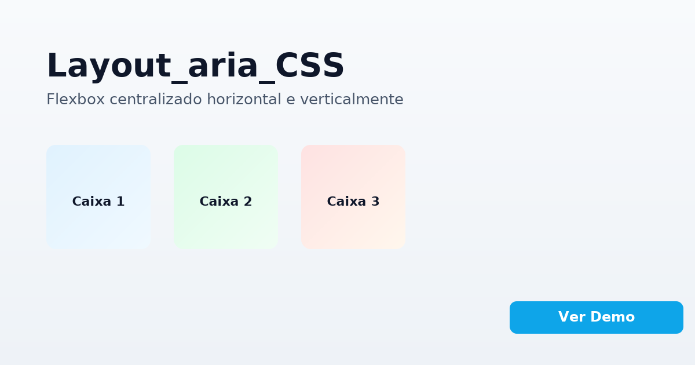

# Layout_aria_CSS

Exemplo profissional e acessível de layout com Flexbox. Três caixas centralizadas horizontal e verticalmente dentro de um contêiner com altura mínima, ideal para demonstrar domínio de CSS moderno no seu portfólio.

## Tecnologias
- HTML5 semântico
- CSS3 (Flexbox)
- Acessibilidade (ARIA + heading invisível para leitores de tela)

## Como visualizar
1. Abra `index.html` em qualquer navegador moderno.
2. Ou acesse a versão publicada via GitHub Pages: https://matheussiqueirahub.github.io/layout_aria_CSS/

## Estrutura
- `index.html` — marcação e estrutura semântica
- `styles.css` — estilos, incluindo centralização com `display: flex; justify-content: center; align-items: center;` e `min-height` para evidenciar o alinhamento vertical

## Créditos
Feito por Matheus Siqueira.
